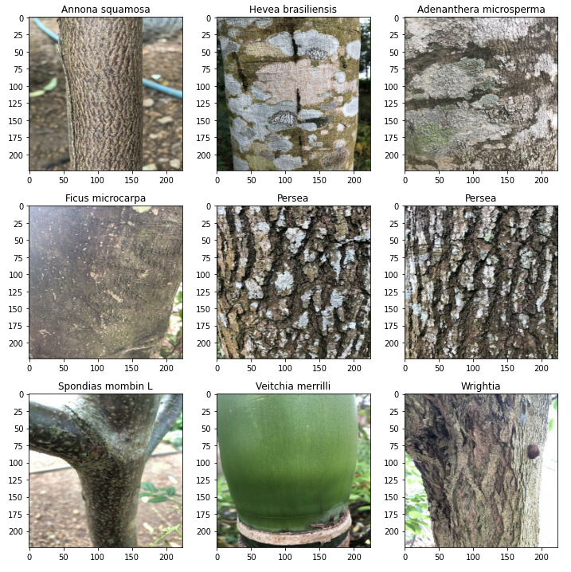
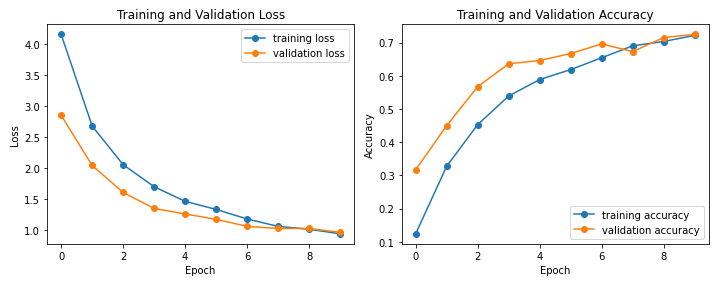

# neural-trees
A myriad of tree classification models that uses the images of barks of trees in order to classify a tree into one of 50 classes with a 72% accuracy.

## Objective
This project is about classifying what type of tree species a tree belongs to solely based off of an image of its bark, in specific, we'll start with classifying a various amount of trees to be exact 50 types of different trees each of which have a different type of bark with over a hundred pictures to each type of tree bark. The goal is construct a model that has an above 70% accuracy with both training and validation sets, and the difference between the validation set is less than 5%, because we don't want our model to over fit.

-------------------
## Here are some samples of the classes

-------------------

## Results
Here are the results that were able to be achieved using a transfer learninig mode called `ResNet50V2` using 10 epochs and a couple added dropout and dense layers we were able to observe the behaviour of the given model acros 10 epochs, here is what we observed.
!

